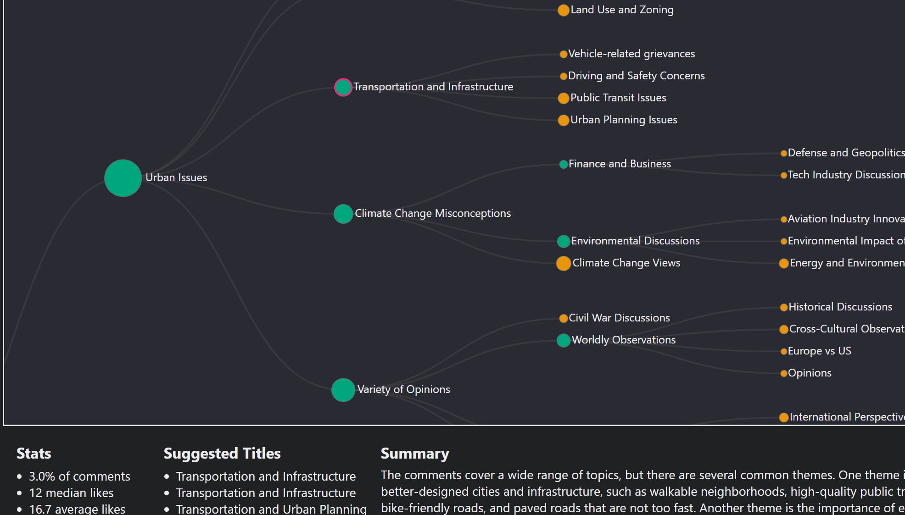

# Hierarchical Categories of Slow Boring Comments

Uses OpenAI text [embeddings](https://platform.openai.com/docs/guides/embeddings/what-are-embeddings) 
to construct a hierarchy of categories for comments on [Slow Boring](https://www.slowboring.com/).

You can explore the structure of categories in the interactive demo at [matthagy.github.io/sb_comment_category_hierarchy](https://matthagy.github.io/sb_comment_category_hierarchy/)

Learn more about the methods in [Hierarchical categorization of substack comments](https://matthagy.substack.com/p/hierarchical-categorization-of-substack)